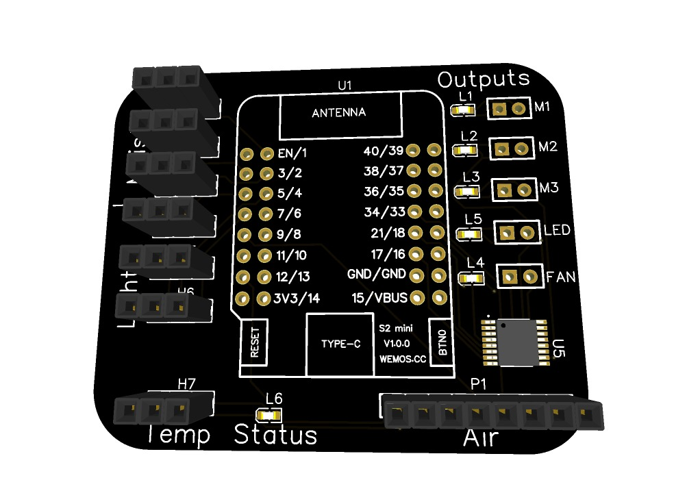
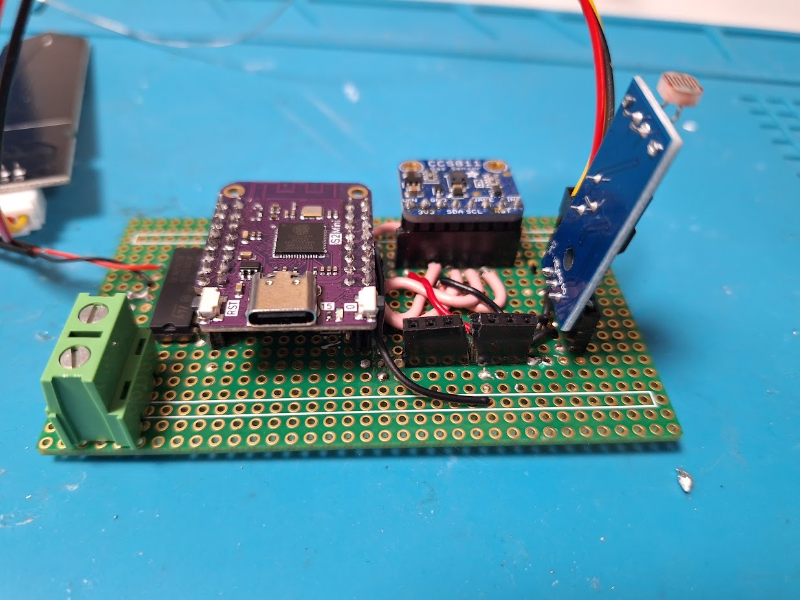
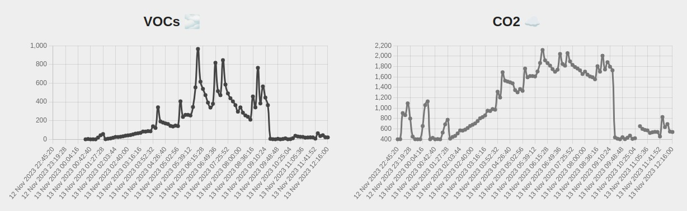

# 🪴 Plant

## [📈 Dashboard](https://plant.etinaude.dev)

### [plant.etinaude.dev](https://plant.etinaude.dev)

### ✔️ Prerequisite

- [BunJs](https://bunjs.dev) or npm
- Set up Firebase with a real-time database
- Add firebase keys to `webapp/src/keys.json`

### 📚 Install Libraries

`bun i`

### 🏃 Run

`bun run dev`

## ⚡ Electronics

### [Easy EDA design](https://easyeda.com/editor#id=12a974c2c440434495f13cfdb8ba623a)

### 🔋 Components

| 🧮 Logic                      | ➡️ Input                              | Output ➡️   |
| ----------------------------- | ------------------------------------- | ----------- |
| Wemos S2 mini Microcontroller | CCS811 Air quality sensor             | 5v Pump     |
| uln2003 Transistor IC         | DHT22 Temperature and Humidity Sensor | 5v Leds     |
| 5v 3A PSU                     | Capacity soil moisture sensor         | 5v 40mm fan |
|                               | LDR                                   |             |

## 💾 Embedded System

### ✔️ Prerequisite

- Arduino IDE
- ESP-32 board manger

### 📚 Install Libraries

Install these libraries:

- CCS811-SOLDERED
- Wire
- DHT22
- Ewma
- ESP32Firebase
- WiFi

### 🏃 Run

add `embedded/keys.h` with this content:

```cpp
#define SSID ""  // WiFi SSID
#define PASSWORD ""  // WiFi Password
#define REFERENCE_URL "" // Firebase realtime database reference URL
```

Upload the code to the Wemos S2. Make sure it has Arduino firmware flashed.

## 📸 Images

| 🔋 PCB                    | ⚡ Electronics                            | 📈 Dashboard                  |
| ------------------------- | ----------------------------------------- | ----------------------------- |
|  |  |  |
